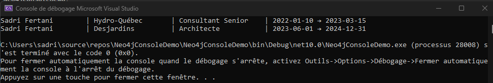

# Constraints
```
CREATE CONSTRAINT personne_id IF NOT EXISTS FOR (p:Personne) REQUIRE p.id IS UNIQUE;
CREATE CONSTRAINT competence_nom IF NOT EXISTS FOR (c:Competence) REQUIRE c.nom IS UNIQUE;
CREATE CONSTRAINT mission_id IF NOT EXISTS FOR (m:Mission) REQUIRE m.id IS UNIQUE;
CREATE CONSTRAINT client_nom IF NOT EXISTS FOR (cl:Client) REQUIRE cl.nom IS UNIQUE;
```

# Data
```
// Clients
CREATE (c1:Client {nom: 'Banque Nationale'})
CREATE (c2:Client {nom: 'Desjardins'})
CREATE (c3:Client {nom: 'Hydro-Québec'})

// Compétences
CREATE (comp1:Competence {nom: 'C#', categorie: 'Langage'})
CREATE (comp2:Competence {nom: '.NET', categorie: 'Framework'})
CREATE (comp3:Competence {nom: 'Azure', categorie: 'Cloud'})
CREATE (comp4:Competence {nom: 'Clean Architecture', categorie: 'Pattern'})
CREATE (comp5:Competence {nom: 'Scrum', categorie: 'Methodologie'})
CREATE (comp6:Competence {nom: 'Neo4j', categorie: 'Base de donnees'})

// Personnes (en plus de tes 2 existantes)
CREATE (p1:Personne {id: 'p1', nom: 'Marie Tremblay', seniorite: 'Senior', disponible: true})
CREATE (p2:Personne {id: 'p2', nom: 'Sadri Fertani', seniorite: 'Senior', disponible: false})
CREATE (p3:Personne {id: 'p3', nom: 'Julie Bouchard', seniorite: 'Junior', disponible: true})

// Missions
CREATE (m1:Mission {id: 'm1', statut: 'active', date_debut: date('2025-01-15')})
CREATE (m2:Mission {id: 'm2', statut: 'terminee', date_debut: date('2023-06-01'), date_fin: date('2024-12-31')})

// Relations Mission -> Client
CREATE (m1)-[:POUR]->(c1)
CREATE (m2)-[:POUR]->(c2)

// Relations Mission -> Competences requises
CREATE (m1)-[:REQUIERT {niveau_min: 'confirme'}]->(comp1)
CREATE (m1)-[:REQUIERT {niveau_min: 'confirme'}]->(comp2)
CREATE (m1)-[:REQUIERT {niveau_min: 'expert'}]->(comp4)

// Relations Personne -> Competence

CREATE (p1)-[:MAITRISE {niveau: 'expert', annees_experience: 6}]->(comp1)
CREATE (p1)-[:MAITRISE {niveau: 'confirme', annees_experience: 3}]->(comp3)
CREATE (p2)-[:MAITRISE {niveau: 'expert', annees_experience: 8}]->(comp2)
CREATE (p2)-[:MAITRISE {niveau: 'expert', annees_experience: 5}]->(comp4)
CREATE (p3)-[:MAITRISE {niveau: 'debutant', annees_experience: 1}]->(comp1)

// Relations Personne -> Mission
CREATE (p2)-[:A_TRAVAILLE_SUR {role: 'Architecte'}]->(m2)

// Réseau interne
CREATE (p2)-[:CONNAIT]->(p1)
CREATE (p2)-[:CONNAIT]->(p3)

MERGE (cl3:Client {nom: 'Hydro-Québec'})
MERGE (m3:Mission {id: 'm3'})
ON CREATE SET m3.statut = 'terminee', m3.date_debut = date('2022-01-10'), m3.date_fin = date('2023-03-15')
MERGE (m3)-[:POUR]->(cl3)
WITH m3
MATCH (p2:Personne {nom: 'Sadri Fertani'})
MERGE (p2)-[:A_TRAVAILLE_SUR {role: 'Consultant Senior'}]->(m3);000000000000000
```

